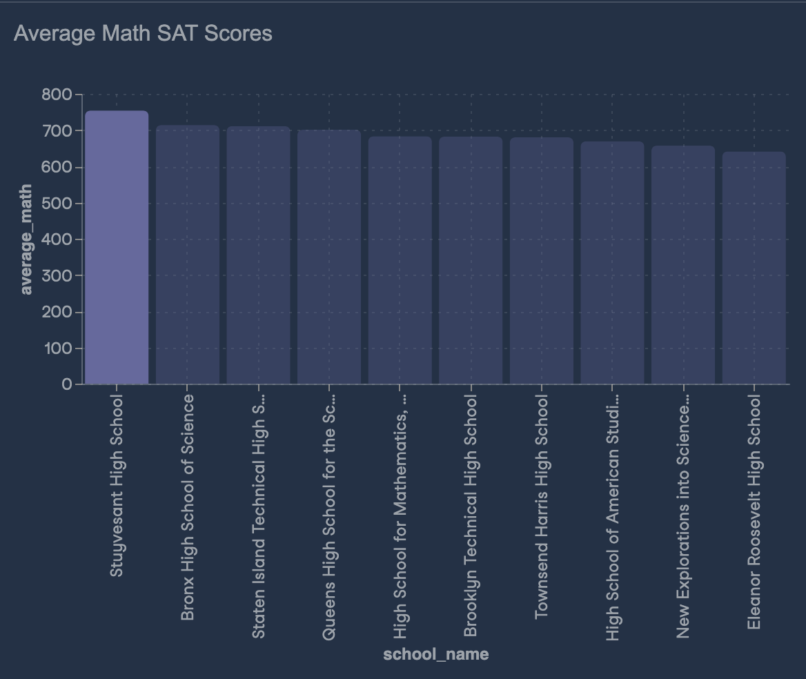
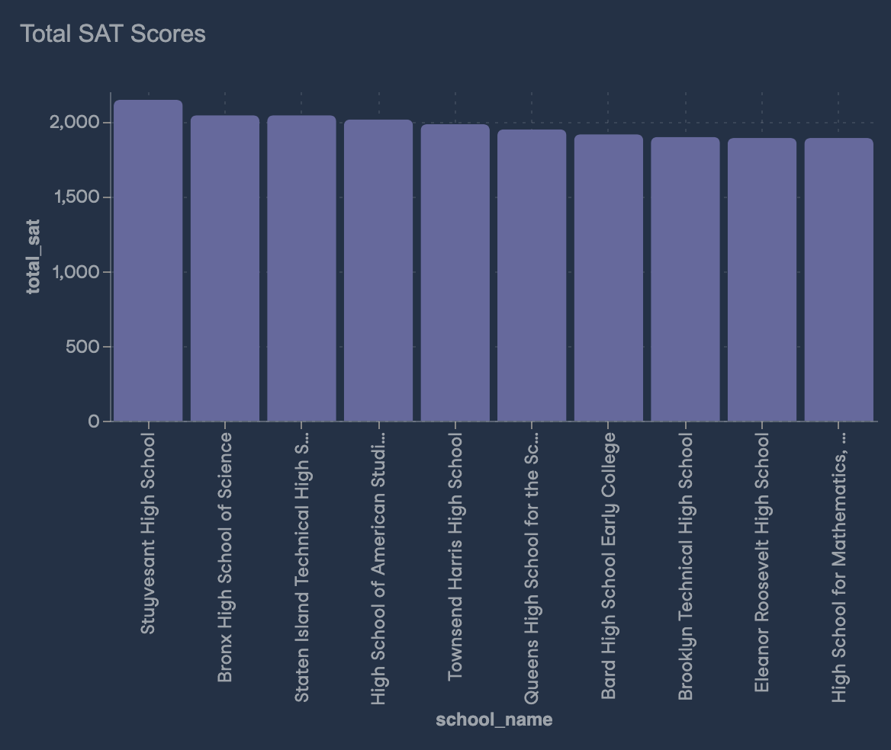
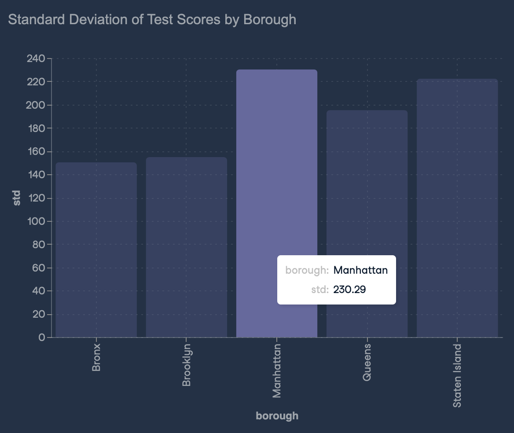

# Exploring NYC Public School Test Result Scores

Every year, American high school students take SATs, which are standardized tests intended to measure literacy, numeracy, and writing skills. There are three sections - reading, math, and writing, each with a maximum score of 800 points. These tests are extremely important for students and colleges, as they play a pivotal role in the admissions process.

Analyzing the performance of schools is important for a variety of stakeholders, including policy and education professionals, researchers, government, and even parents considering which school their children should attend.

I have been provided with a dataset called schools.csv, which is previewed below.

I have been tasked with answering three key questions about New York City (NYC) public school SAT performance.

# 1. Which NYC schools have the best math results?

To answer this question, I started with a quick calculation. The best math score is typically at least 80% of the maximum possible score of 800, which means an average of 640 or higher is needed to be considered one of the best schools. Based on this, I found that Stuyvesant High School stood out as the top school for math, with an impressive average score of 754.

# 2. What are the top 10 performing schools based on the combined SAT scores?

To answer this question I first calculated the total SAT score per school. After calculating the total I sorted them in descending order to get the top 10 schools. Again, Stuyvesant High School came out on top as the highest performing school.

# 3. Which single borough has the largest standard deviation in the combined SAT score?

After calculating the standard deviation of each borough, it appears that Manhattan had the largest standard deviation of 230.29. 

